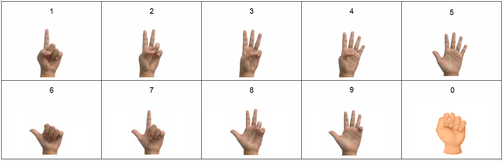

# HGR-TH
Thai Hand Gesture Recognition using [MediaPipe](https://mediapipe.dev/)

The elevator control is `activated` and `deactivated` with `showing up` and `vanishing`

## Scope Of Works
- Thai Hand Gesture
- Use case: Elevator control in covid pandemic situation

## Challenges
- Real-Time computing
- Handle multiple hands in the same time
- Handle both `right-hand` and `left-hand`
- Handle more than 10 gestures

## Hand Gestures Definition
As almost all of Thai people don't know the standard hand gesture definition, so I used the definition that they are more familliar with which are shown below.

## Pipeline
To implement hand gesture recognition, there are `3` step which are shown below:
- **Hand Detection**: `MediaPipe`
  - To detect hands in frame
- **Hand Tracking**: `Algorithm`
  - To handle multiple hands in the same time
- **Gesture Recognition**: `Algorithm`
  - To overcome amount of gesture limitation 
  - To recognize gesture
  - To handle both `right-hand` and `left-hand`

## Hand Detection
Fotunately, [MediaPipe](https://mediapipe.dev/) has provided `MediaPipe Hands` which not only can detect hand in frame but also return the coordinate `x`, `y` and `z` of each `21 landmarks` on each hand in frame. Furthermore, it can also detect that whether the hand in frame is `right` or `left` hand.

In this project, I used `Python Solution API` as a hand detection, you can read more details in [their website](https://google.github.io/mediapipe/solutions/hands).

## Hand Tracking
There are only `3` events that can happen in each frame: the numbers of hand in frame is `increasing`, `decreasing` or `equaling`. So, in each events, we do the different process.

The main idea of this algorithm is comparing the center of box of each hand between the `previous frame` and the `present frame`. And using `Euclidean Distance` to compare them.

## Gesture Recognition
As `MediaPipe Hands` returns the coordinate `x`, `y` and `z` of each `21 landmarks` on each hand in frame, I use only coordinate `x` and `y` to recognize the gesture because the `z` is not robust enough.

There are `2` step in this process:
- 1. Use coordinate `x` and `y` to identify the `status` of each finger whether it is `on` or `off`
- 2. Use the status of each finger to identify the gesture by following the `Hand Gestures Definition`

To handle more than one digit, `timing` is brought into play. And using `threshold` to indicate that the recognized gesture is correct (After trying many number of `threshold`, `10` is fit my case).
